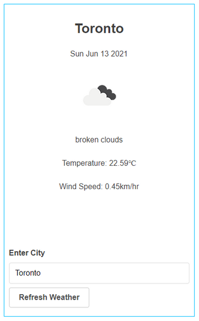

# my-weather
This React/Redux app detects a user's city and displays the current weather for that city.

Weather data is obtained from the [OpenWeather API](https://openweathermap.org/api) via an intermediary GraphQL server: [https://github.com/konstantinmuenster/graphql-weather-api](https://github.com/konstantinmuenster/graphql-weather-api)

A user's approximate location is determined using the [InInfo.io API](https://ipinfo.io).

[Primitive UI](https://taniarascia.github.io/primitive/) was used for simple styling.

## Setup
`npm install`

In one window, start the graphql-weather-api.

In the my-weather app folder, add a `.env` file and insert your IpInfo.io token:
```
REACT_APP_IPINFO_TOKEN=<token>
```

Next, start the my-weather app: 

`npm run start`

## Tests
`npm run test`

## Usage
When the app starts, it will detect your city and display the weather for that city.



You can click the `Refresh Weather` button to reload the weather data. (Note however, in accordance with the OpenWeather usage guidelinies, new data is only fetched (for the city that's currently displayed) if 10min have elapsed. Otherwise, the existing data will be displayed.)

To get the weather for a different city, enter the city in the text box and click `Refresh Weather`.
